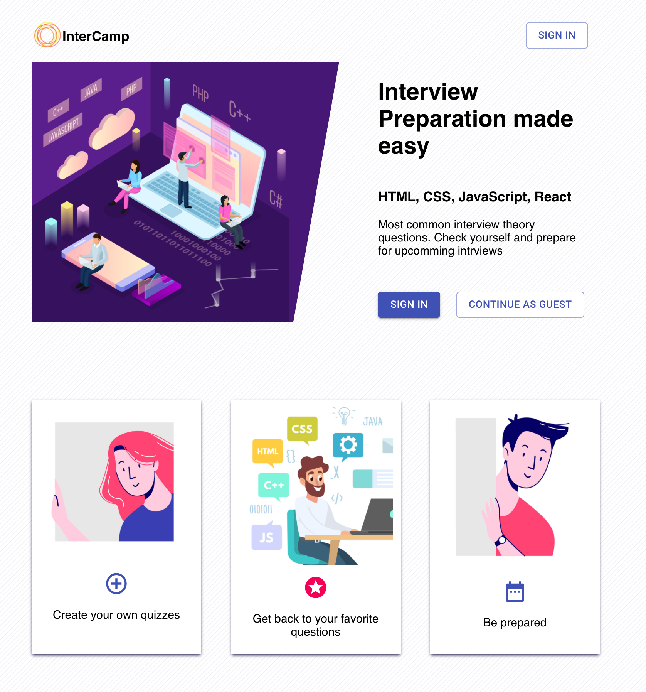

  <h1>Overview and Goals</h1>
  
InterCamp is an interview preparation platform, where users can check their knowledge on a specific topic.
    
  User friendly and responsive design, build using React & Redux libraries.
    
  Created reusable components with Material UI and SASS. Sign-In workflow with Firebase.
    
  The biggest challenge was to structure data, so all the updates are efficient and easy to make.

  <h1>Completed MVP</h1>
  
Log in workflow with Firebase
    
  Authenticate Using Google Sign-In, GitHub Sig-in, Facebook Login
   
  Handling account-exists-with-different-credential Errors
  

  
  
Store quiz data in Firestore and make Asynchronous calls with a help of Redux-thunk library

  
  

